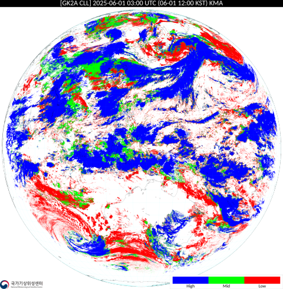

# GK2A Satellite Imagery Fetcher

A comprehensive Python tool for retrieving high-resolution satellite imagery from Korea's Geo-Kompsat-2A (GK2A) satellite. This utility enables downloading of atmospheric and surface observation data across multiple channels, regions, and time ranges without requiring API authentication.

## Key Features

-   **Complete GK2A Coverage**: Supports all GK2A image products including `LEVEL1B` and `LEVEL2` datasets
-   **Extensive Channel Support**: Access to 108 satellite imagery channels with 324 unique image variations across supported regions
-   **Superior Image Quality**: Downloads native high-resolution imagery exceeding standard API limitations
-   **Flexible Configuration**: Customizable observation regions (`area`) and data channels (`ch`) selection
-   **Time-Series Capability**: Precise time-bounded downloads with configurable start and end parameters
-   **Variable Resolution**: Support for resolutions ranging from 900×900 pixels (regional) to 11,000×11,275 pixels (full-disk)

## Important Considerations

-   **Service Dependencies**: Imagery is accessed through URL-based services that may experience changes in domain structure, directory organization, or file formats, potentially causing temporary service interruptions
-   **Data Availability**: Image availability depends on observation schedules, satellite operations, and server maintenance windows
-   **Operational Constraints**: The GK2A AMI (Advanced Meteorological Imager) instrument is offline during satellite maneuvers including station-keeping and wheel off-loading operations. Consult the [official operational schedule](https://nmsc.kma.go.kr/enhome/html/base/cmm/selectPage.do?page=satellite.gk2a.operScheduling) for current status

### Data Availability by Channel

<table>
  <colgroup>
    <col style="width: 45%;text-align:center;"/>
    <col style="width: 35%;text-align:center;"/>
    <col style="width: 20%;text-align:center;"/>
  </colgroup>
  <thead>
    <tr>
      <th style="background-color:#f2f2f2;">Channel Group</th>
      <th style="background-color:#f2f2f2;">Description</th>
      <th style="background-color:#f2f2f2;">Available Regions</th>
    </tr>
  </thead>
  <tbody>
    <tr>
      <td style="text-align:center;"><code>fr</code>, <code>sst-1dm</code>, <code>sst-5dm</code>, <code>sst-10dm</code>, <code>ssc</code>, <code>tchp</code>, <code>ssta</code>, <code>ocn-of</code>, <code>ocn-vicing</code>, <code>scsi-1dm</code>, <code>vgt-ndvi</code>, <code>vgt-fvc</code>, <code>lse-038</code>, <code>lse-087</code>, <code>lse-105</code>, <code>lse-123</code>, <code>sal-bsa</code>, <code>sal-wsa</code></td>
      <td style="text-align:center;">One image per day (00:00 UTC)</td>
      <td style="text-align:center;">Global</td>
    </tr>
    <tr>
      <td style="text-align:center;"><code>fog</code>, <code>ssta</code>, <code>avis</code></td>
      <td style="text-align:center;">East Asia and Korean peninsula only</td>
      <td style="text-align:center;">ea, ko</td>
    </tr>
    <tr>
      <td style="text-align:center;"><code>ci-ci1</code>, <code>tchp</code>, <code>ocn-of</code>, <code>ocn-vicing</code>, <code>icing</code>, <code>ot</code>, <code>ai-dsr</code>, <code>ai-uvi</code></td>
      <td style="text-align:center;">Korean peninsula only</td>
      <td style="text-align:center;">ko</td>
    </tr>
  </tbody>
</table>

## Installation

### Prerequisites
- Python 3.10 or higher
- pip package manager

### Setup Instructions

1.  **Clone the Repository**
    ```bash
    git clone https://github.com/liquidstereo/gk2a.git && cd gk2a
    ```

2.  **Install Dependencies**
    ```bash
    pip install -r requirements.txt
    ```

## Usage

### Command Line Interface

Execute the script using the following syntax:

```bash
python gk2a.py [-a <area>] [-ch <channel>] [-s <start_time>] [-e <end_time>] [-x <extension>] [-p <preview>]
```

### Command Line Arguments

<table>
  <colgroup>
    <col style="width: 10%;text-align:center;"/>
    <col style="width: 15%;text-align:center;"/>
    <col style="width: auto;text-align:center;"/>
    <col style="width: 12%;text-align:center;"/>
  </colgroup>
  <thead>
    <tr>
      <th style="background-color:#f2f2f2;">Arg</th>
      <th style="background-color:#f2f2f2;">Long Form</th>
      <th style="background-color:#f2f2f2;">Description</th>
      <th style="background-color:#f2f2f2;">Default</th>
    </tr>
  </thead>
  <tbody>
      <tr>
      <td style="text-align:center;"><code>-a</code></td>
      <td style="text-align:center;">--area</td>
      <td style="text-align:center;">Target observation region<br>("fd" for full-disk, "ea" for East Asia, "ko" for Korea)</td>
      <td style="text-align:center;"><code>fd</code></td>
    </tr>
    <tr>
      <td style="text-align:center;"><code>-ch</code></td>
      <td style="text-align:center;">--channel</td>
      <td style="text-align:center;">Satellite channel identifier (e.g., rgb-true, vi006, ir105)</td>
      <td style="text-align:center;"><code>rgb-true</code></td>
    </tr>
    <tr>
      <td style="text-align:center;"><code>-x</code></td>
      <td style="text-align:center;">--extension</td>
      <td style="text-align:center;">Output image file format (.srv.png, .png)</td>
      <td style="text-align:center;"><code>.srv.png</code></td>
    </tr>
    <tr>
      <td style="text-align:center;"><code>-s</code></td>
      <td style="text-align:center;">--start</td>
      <td style="text-align:center;">Start datetime in 10-minute intervals (YYYY-MM-DD HH:MM)</td>
      <td style="text-align:center;"><code>None</code></td>
    </tr>
    <tr>
      <td style="text-align:center;"><code>-e</code></td>
      <td style="text-align:center;">--end</td>
      <td style="text-align:center;">End datetime in 10-minute intervals (YYYY-MM-DD HH:MM)</td>
      <td style="text-align:center;"><code>None</code></td>
    </tr>
    <tr>
      <td style="text-align:center;"><code>-p</code></td>
      <td style="text-align:center;">--preview</td>
      <td style="text-align:center;">Enable image preview after download</td>
      <td style="text-align:center;"><code>False</code></td>
    </tr>
  </tbody>
</table>


### Usage Examples

#### Basic Download with Preview
```bash
# Download full-disk vi006 channel imagery with preview enabled
python gk2a.py -a fd -ch vi006 -s '2025-08-01 00:00' -e '2025-08-01 23:50' -p
```

#### High-Resolution Download
```bash
# Download maximum resolution RGB true-color imagery
python gk2a.py -a fd -ch rgb-true -s '2025-08-01 00:00' -e '2025-08-01 23:50' -x '.png'
```

#### Regional Data Collection
```bash
# Download Korean peninsula infrared imagery
python gk2a.py -a ko -ch ir105 -s '2025-08-01 12:00' -e '2025-08-01 18:00'
```

## Sample Imagery: LEVEL1B Channels

<table>
  <colgroup>
    <col style="width: 400px;"/>
    <col style="width: 70px;"/>
    <col style="width: auto;"/>
  </colgroup>
  <thead>
    <tr>
      <th style="background-color:#f2f2f2;">Image</th>
      <th style="background-color:#f2f2f2;">Channel</th>
      <th style="background-color:#f2f2f2;">Description</th>
    </tr>
  </thead>
  <tbody>
    <tr>
      <td style="text-align:center;"></td>
      <td style="text-align:center;"><code>vi004</code></td>
      <td style="text-align:center;">Visible (0.47㎛)</td>
    </tr>
    <tr>
      <td style="text-align:center;"></td>
      <td style="text-align:center;"><code>vi005</code></td>
      <td style="text-align:center;">Visible (0.51μm)</td>
    </tr>
    <tr>
      <td style="text-align:center;"></td>
      <td style="text-align:center;"><code>vi006</code></td>
      <td style="text-align:center;">Visible (0.64μm)</td>
    </tr>
    <tr>
      <td style="text-align:center;"></td>
      <td style="text-align:center;"><code>vi008</code></td>
      <td style="text-align:center;">Visible (0.86μm)</td>
    </tr>
    <tr>
      <td style="text-align:center;"></td>
      <td style="text-align:center;"><code>nr013</code></td>
      <td style="text-align:center;">Near-infrared (1.37μm)</td>
    </tr>
    <tr>
      <td style="text-align:center;"></td>
      <td style="text-align:center;"><code>nr016</code></td>
      <td style="text-align:center;">Near-infrared (1.6μm)</td>
    </tr>
    <tr>
      <td style="text-align:center;"></td>
      <td style="text-align:center;"><code>sw038</code></td>
      <td style="text-align:center;">Short-wavelength infrared (3.8μm)</td>
    </tr>
    <tr>
      <td style="text-align:center;"></td>
      <td style="text-align:center;"><code>wv063</code></td>
      <td style="text-align:center;">Water vapor (6.3μm)</td>
    </tr>
    <tr>
      <td style="text-align:center;"></td>
      <td style="text-align:center;"><code>wv069</code></td>
      <td style="text-align:center;">Water vapor (6.9μm)</td>
    </tr>
    <tr>
      <td style="text-align:center;"></td>
      <td style="text-align:center;"><code>wv073</code></td>
      <td style="text-align:center;">Water vapor (7.3μm)</td>
    </tr>
    <tr>
      <td style="text-align:center;"></td>
      <td style="text-align:center;"><code>ir087</code></td>
      <td style="text-align:center;">Infrared (8.7μm)</td>
    </tr>
    <tr>
      <td style="text-align:center;"></td>
      <td style="text-align:center;"><code>ir096</code></td>
      <td style="text-align:center;">Infrared (9.6μm)</td>
    </tr>
    <tr>
      <td style="text-align:center;"></td>
      <td style="text-align:center;"><code>ir105</code></td>
      <td style="text-align:center;">Infrared (10.5μm)</td>
    </tr>
    <tr>
      <td style="text-align:center;"></td>
      <td style="text-align:center;"><code>ir112</code></td>
      <td style="text-align:center;">Infrared (11.2μm)</td>
    </tr>
    <tr>
      <td style="text-align:center;"></td>
      <td style="text-align:center;"><code>ir123</code></td>
      <td style="text-align:center;">Infrared (12.3μm)</td>
    </tr>
    <tr>
      <td style="text-align:center;"></td>
      <td style="text-align:center;"><code>ir133</code></td>
      <td style="text-align:center;">Infrared (13.3μm)</td>
    </tr>
    <tr>
      <td style="text-align:center;"></td>
      <td style="text-align:center;"><code>rgb-true</code></td>
      <td style="text-align:center;">RGB TRUE</td>
    </tr>
    <tr>
      <td style="text-align:center;"></td>
      <td style="text-align:center;"><code>rgb-wv1</code></td>
      <td style="text-align:center;">RGB 3CH WV</td>
    </tr>
    <tr>
      <td style="text-align:center;"></td>
      <td style="text-align:center;"><code>rgb-natural</code></td>
      <td style="text-align:center;">RGB NATURAL</td>
    </tr>
    <tr>
      <td style="text-align:center;"></td>
      <td style="text-align:center;"><code>rgb-airmass</code></td>
      <td style="text-align:center;">RGB AIRMASS</td>
    </tr>
    <tr>
      <td style="text-align:center;"></td>
      <td style="text-align:center;"><code>rgb-dust</code></td>
      <td style="text-align:center;">RGB DUST</td>
    </tr>
    <tr>
      <td style="text-align:center;"></td>
      <td style="text-align:center;"><code>rgb-daynight</code></td>
      <td style="text-align:center;">RGB DAYNIGHT</td>
    </tr>
    <tr>
      <td style="text-align:center;"></td>
      <td style="text-align:center;"><code>rgb-fog</code></td>
      <td style="text-align:center;">RGB FOG</td>
    </tr>
    <tr>
      <td style="text-align:center;"></td>
      <td style="text-align:center;"><code>rgb-storm</code></td>
      <td style="text-align:center;">RGB STORM</td>
    </tr>
    <tr>
      <td style="text-align:center;"></td>
      <td style="text-align:center;"><code>rgb-snowfog</code></td>
      <td style="text-align:center;">RGB SNOW FOG</td>
    </tr>
    <tr>
      <td style="text-align:center;"></td>
      <td style="text-align:center;"><code>rgb-cloud</code></td>
      <td style="text-align:center;">RGB CLOUD</td>
    </tr>
    <tr>
      <td style="text-align:center;"></td>
      <td style="text-align:center;"><code>rgb-ash</code></td>
      <td style="text-align:center;">RGB ASH</td>
    </tr>
    <tr>
      <td style="text-align:center;"></td>
      <td style="text-align:center;"><code>enhc-wv063</code></td>
      <td style="text-align:center;">EIR WV(6.3μm)</td>
    </tr>
    <tr>
      <td style="text-align:center;"></td>
      <td style="text-align:center;"><code>enhc-wv069</code></td>
      <td style="text-align:center;">EIR WV(6.9μm)</td>
    </tr>
    <tr>
      <td style="text-align:center;"></td>
      <td style="text-align:center;"><code>enhc-wv073</code></td>
      <td style="text-align:center;">EIR WV(7.3μm)</td>
    </tr>
    <tr>
      <td style="text-align:center;"></td>
      <td style="text-align:center;"><code>enhc-color-ir105</code></td>
      <td style="text-align:center;">EIR IR COLOR(10.5μm)</td>
    </tr>
    </tr>
  </tbody>
</table>


## Sample Imagery: LEVEL2 Products

<table>
  <colgroup>
    <col style="width: 400px;"/>
    <col style="width: 70px;"/>
    <col style="width: auto;"/>
  </colgroup>
  <thead>
    <tr>
      <th style="background-color:#f2f2f2;">Image</th>
      <th style="background-color:#f2f2f2;">Channel</th>
      <th style="background-color:#f2f2f2;">Description</th>
    </tr>
  </thead>
  <tbody>
    <tr>
    <tr>
      <td style="text-align:center;"></td>
      <td style="text-align:center;"><code>rr</code></td>
      <td style="text-align:center;">Rainfall Rate</td>
    </tr>
    <tr>
      <td style="text-align:center;"></td>
      <td style="text-align:center;"><code>tpw-um</code></td>
      <td style="text-align:center;">Total Precipitation Water</td>
    </tr>
    <tr>
      <td style="text-align:center;"></td>
      <td style="text-align:center;"><code>qpn-por</code></td>
      <td style="text-align:center;">Probability of Rainfall</td>
    </tr>
    <tr>
      <td style="text-align:center;"></td>
      <td style="text-align:center;"><code>qpn-par</code></td>
      <td style="text-align:center;">Potential Accumulated Rainfall</td>
    </tr>
    <tr>
      <td style="text-align:center;"></td>
      <td style="text-align:center;"><code>aii-ki-um</code></td>
      <td style="text-align:center;">K Index</td>
    </tr>
    <tr>
      <td style="text-align:center;"></td>
      <td style="text-align:center;"><code>aii-li-um</code></td>
      <td style="text-align:center;">Lifted Index</td>
    </tr>
    <tr>
      <td style="text-align:center;"></td>
      <td style="text-align:center;"><code>aii-ssi-um</code></td>
      <td style="text-align:center;">Showalter Index</td>
    </tr>
    <tr>
      <td style="text-align:center;"></td>
      <td style="text-align:center;"><code>aii-tti-um</code></td>
      <td style="text-align:center;">Total Totals Index</td>
    </tr>
    <tr>
      <td style="text-align:center;"></td>
      <td style="text-align:center;"><code>aii-cape-um</code></td>
      <td style="text-align:center;">Convective Available Potential Energy</td>
    </tr>
    <tr>
      <td style="text-align:center;"></td>
      <td style="text-align:center;"><code>tqprof-t300hpa-um</code></td>
      <td style="text-align:center;">Vertical Temperature Profile - 300hPa</td>
    </tr>
    <tr>
      <td style="text-align:center;"></td>
      <td style="text-align:center;"><code>tqprof-t500hpa-um</code></td>
      <td style="text-align:center;">Vertical Temperature Profile - 500hPa</td>
    </tr>
    <tr>
      <td style="text-align:center;"></td>
      <td style="text-align:center;"><code>tqprof-t850hpa-um</code></td>
      <td style="text-align:center;">Vertical Temperature Profile - 850hPa</td>
    </tr>
    <tr>
      <td style="text-align:center;"></td>
      <td style="text-align:center;"><code>tqprof-q300hpa-um</code></td>
      <td style="text-align:center;">Vertical Humidity Profile - 300hPa</td>
    </tr>
    <tr>
      <td style="text-align:center;"></td>
      <td style="text-align:center;"><code>tqprof-q500hpa-um</code></td>
      <td style="text-align:center;">Vertical Humidity Profile - 500hPa</td>
    </tr>
    <tr>
      <td style="text-align:center;"></td>
      <td style="text-align:center;"><code>tqprof-q850hpa-um</code></td>
      <td style="text-align:center;">Vertical Humidity Profile - 850hPa</td>
    </tr>
    <tr>
      <td style="text-align:center;"></td>
      <td style="text-align:center;"><code>ctps-ctt</code></td>
      <td style="text-align:center;">Cloud Top Temperature</td>
    </tr>
    <tr>
      <td style="text-align:center;"></td>
      <td style="text-align:center;"><code>ctps-ctp</code></td>
      <td style="text-align:center;">Cloud Top Pressure</td>
    </tr>
    <tr>
      <td style="text-align:center;"></td>
      <td style="text-align:center;"><code>ctps-cth</code></td>
      <td style="text-align:center;">Cloud Top Height</td>
    </tr>
    <tr>
      <td style="text-align:center;"></td>
      <td style="text-align:center;"><code>ctps-cp</code></td>
      <td style="text-align:center;">Cloud Phase</td>
    </tr>
    <tr>
      <td style="text-align:center;"></td>
      <td style="text-align:center;"><code>cla-ct</code></td>
      <td style="text-align:center;">Cloud Type</td>
    </tr>
    <tr>
      <td style="text-align:center;"></td>
      <td style="text-align:center;"><code>cla-cll</code></td>
      <td style="text-align:center;">Cloud Layer/Level</td>
    </tr>
    <tr>
      <td style="text-align:center;"></td>
      <td style="text-align:center;"><code>cld</code></td>
      <td style="text-align:center;">Cloud Detection</td>
    </tr>
    <tr>
      <td style="text-align:center;"></td>
      <td style="text-align:center;"><code>dcoew-cot</code></td>
      <td style="text-align:center;">Cloud Optical Thickness</td>
    </tr>
    <tr>
      <td style="text-align:center;"></td>
      <td style="text-align:center;"><code>dcoew-cer</code></td>
      <td style="text-align:center;">Cloud Effective Radius</td>
    </tr>
    <tr>
      <td style="text-align:center;"></td>
      <td style="text-align:center;"><code>dcoew-lwp</code></td>
      <td style="text-align:center;">Cloud Liquid Water Path</td>
    </tr>
    <tr>
      <td style="text-align:center;"></td>
      <td style="text-align:center;"><code>dcoew-iwp</code></td>
      <td style="text-align:center;">Cloud Ice Water Path</td>
    </tr>
    <tr>
      <td style="text-align:center;"></td>
      <td style="text-align:center;"><code>ff</code></td>
      <td style="text-align:center;">Forest Fire</td>
    </tr>
    <tr>
      <td style="text-align:center;"></td>
      <td style="text-align:center;"><code>fr</code></td>
      <td style="text-align:center;">Fire Risk</td>
    </tr>
    <tr>
      <td style="text-align:center;"></td>
      <td style="text-align:center;"><code>sst</code></td>
      <td style="text-align:center;">Sea Surface Temperature</td>
    </tr>
    <tr>
      <td style="text-align:center;"></td>
      <td style="text-align:center;"><code>sst-1dm</code></td>
      <td style="text-align:center;">Sea Surface Temperature 1DM</td>
    </tr>
    <tr>
      <td style="text-align:center;"></td>
      <td style="text-align:center;"><code>sst-5dm</code></td>
      <td style="text-align:center;">Sea Surface Temperature 5DM</td>
    </tr>
    <tr>
      <td style="text-align:center;"></td>
      <td style="text-align:center;"><code>sst-10dm</code></td>
      <td style="text-align:center;">Sea Surface Temperature 10DM</td>
    </tr>
    <tr>
      <td style="text-align:center;"></td>
      <td style="text-align:center;"><code>ssc</code></td>
      <td style="text-align:center;">Sea Surface Current</td>
    </tr>
    <tr>
      <td style="text-align:center;"></td>
      <td style="text-align:center;"><code>ssta</code></td>
      <td style="text-align:center;">Sea Surface Temperature anomaly</td>
    </tr>
    <tr>
      <td style="text-align:center;"></td>
      <td style="text-align:center;"><code>lst</code></td>
      <td style="text-align:center;">Land Surface Temperature</td>
    </tr>
    <tr>
      <td style="text-align:center;"></td>
      <td style="text-align:center;"><code>scsi</code></td>
      <td style="text-align:center;">Snow Cover and Sea ice</td>
    </tr>
    <tr>
      <td style="text-align:center;"></td>
      <td style="text-align:center;"><code>scsi-1dm</code></td>
      <td style="text-align:center;">Snow Cover and Sea ice 1DM</td>
    </tr>
    <tr>
      <td style="text-align:center;"></td>
      <td style="text-align:center;"><code>sd</code></td>
      <td style="text-align:center;">Snow Depth</td>
    </tr>
    <tr>
      <td style="text-align:center;"></td>
      <td style="text-align:center;"><code>vgt-ndvi</code></td>
      <td style="text-align:center;">Normalized Difference Vegetation Index</td>
    </tr>
    <tr>
      <td style="text-align:center;"></td>
      <td style="text-align:center;"><code>vgt-fvc</code></td>
      <td style="text-align:center;">Fractional Vegetation Cover</td>
    </tr>
    <tr>
      <td style="text-align:center;"></td>
      <td style="text-align:center;"><code>lse-038</code></td>
      <td style="text-align:center;">Land Surface Emissivity(3.8)</td>
    </tr>
    <tr>
      <td style="text-align:center;"></td>
      <td style="text-align:center;"><code>lse-087</code></td>
      <td style="text-align:center;">Land Surface Emissivity(8.7)</td>
    </tr>
    <tr>
      <td style="text-align:center;"></td>
      <td style="text-align:center;"><code>lse-105</code></td>
      <td style="text-align:center;">Land Surface Emissivity(10.5)</td>
    </tr>
    <tr>
      <td style="text-align:center;"></td>
      <td style="text-align:center;"><code>lse-123</code></td>
      <td style="text-align:center;">Land Surface Emissivity(12.3)</td>
    </tr>
    <tr>
      <td style="text-align:center;"></td>
      <td style="text-align:center;"><code>sal-bsa</code></td>
      <td style="text-align:center;">Black Sky Shortwave Albedo</td>
    </tr>
    <tr>
      <td style="text-align:center;"></td>
      <td style="text-align:center;"><code>sal-wsa</code></td>
      <td style="text-align:center;">White Sky Shortwave Albedo</td>
    </tr>
    <tr>
      <td style="text-align:center;"></td>
      <td style="text-align:center;"><code>adps</code></td>
      <td style="text-align:center;">Aerosol Detection Products</td>
    </tr>
    <tr>
      <td style="text-align:center;"></td>
      <td style="text-align:center;"><code>apps-aod</code></td>
      <td style="text-align:center;">Aerosol Optical Depth</td>
    </tr>
    <tr>
      <td style="text-align:center;"></td>
      <td style="text-align:center;"><code>apps-daod055</code></td>
      <td style="text-align:center;">Dust Aerosol 0.55 Optical Depth</td>
    </tr>
    <tr>
      <td style="text-align:center;"></td>
      <td style="text-align:center;"><code>apps-aep</code></td>
      <td style="text-align:center;">Aerosol Angstrom Exponent</td>
    </tr>
    <tr>
      <td style="text-align:center;"></td>
      <td style="text-align:center;"><code>amv-ir105-cd</code></td>
      <td style="text-align:center;">Atmospheric Motion Vector-Infrared 105-Cloud</td>
    </tr>
    <tr>
      <td style="text-align:center;"></td>
      <td style="text-align:center;"><code>amv-wv063</code></td>
      <td style="text-align:center;">Atmospheric Motion Vector-Water Vapor 063</td>
    </tr>
    <tr>
      <td style="text-align:center;"></td>
      <td style="text-align:center;"><code>amv-sw038-cd</code></td>
      <td style="text-align:center;">Atmospheric Motion Vector-Shortwave 038-Cloud</td>
    </tr>
    <tr>
      <td style="text-align:center;"></td>
      <td style="text-align:center;"><code>amv-vi006-cd</code></td>
      <td style="text-align:center;">Atmospheric Motion Vector-Visible 006-Cloud</td>
    </tr>
    <tr>
      <td style="text-align:center;"></td>
      <td style="text-align:center;"><code>toz</code></td>
      <td style="text-align:center;">Total Column Ozone</td>
    </tr>
    <tr>
      <td style="text-align:center;"></td>
      <td style="text-align:center;"><code>so2d</code></td>
      <td style="text-align:center;">SO2 Detection</td>
    </tr>
    <tr>
      <td style="text-align:center;"></td>
      <td style="text-align:center;"><code>tftd</code></td>
      <td style="text-align:center;">Tropopause Folding Turbulence Detection</td>
    </tr>
    <tr>
      <td style="text-align:center;"></td>
      <td style="text-align:center;"><code>lwrad-olr</code></td>
      <td style="text-align:center;">Outgoing Longwave Radiation(TOA)</td>
    </tr>
    <tr>
      <td style="text-align:center;"></td>
      <td style="text-align:center;"><code>lwrad-dlr</code></td>
      <td style="text-align:center;">Downward Longwave Radiation(surface)</td>
    </tr>
    <tr>
      <td style="text-align:center;"></td>
      <td style="text-align:center;"><code>lwrad-ulr</code></td>
      <td style="text-align:center;">Upward Longwave Radiation(surface)</td>
    </tr>
    <tr>
      <td style="text-align:center;"></td>
      <td style="text-align:center;"><code>swrad-rsr</code></td>
      <td style="text-align:center;">Reflected Shortwave Radiation(TOA)</td>
    </tr>
    <tr>
      <td style="text-align:center;"></td>
      <td style="text-align:center;"><code>swrad-dsr</code></td>
      <td style="text-align:center;">Downward Shortwave Radiation(surface)</td>
    </tr>
  </tbody>
</table>


## Technical Documentation & Resources

### Official KMA Documentation
- **[GK2A Satellite Overview](https://nmsc.kma.go.kr/enhome/html/base/cmm/selectPage.do?page=satellite.gk2a.intro)** - Comprehensive satellite system information
- **[Product Definitions](https://datasvc.nmsc.kma.go.kr/datasvc/html/base/cmm/selectPage.do?page=static.productDefinition)** - Detailed specifications for all data products
- **[Operational Schedule](https://nmsc.kma.go.kr/enhome/html/base/cmm/selectPage.do?page=satellite.gk2a.operScheduling)** - Current satellite operation status and maintenance windows

### Support Resources
- **[Frequently Asked Questions](https://datasvc.nmsc.kma.go.kr/datasvc/html/base/cmm/selectPage.do?page=static.faq)** - Common usage questions and troubleshooting
- **[Usage Policy & Copyright](https://nmsc.kma.go.kr/homepage/html/base/cmm/selectPage.do?page=static.etc.copyrightProtectionPolicy)** - Terms of use and attribution requirements

---

## License

This project is licensed under the MIT License.